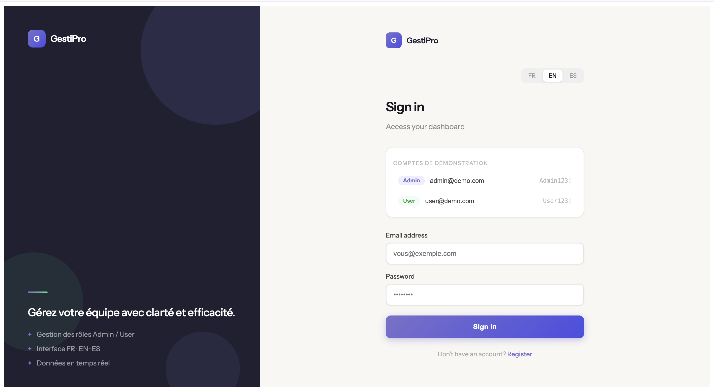
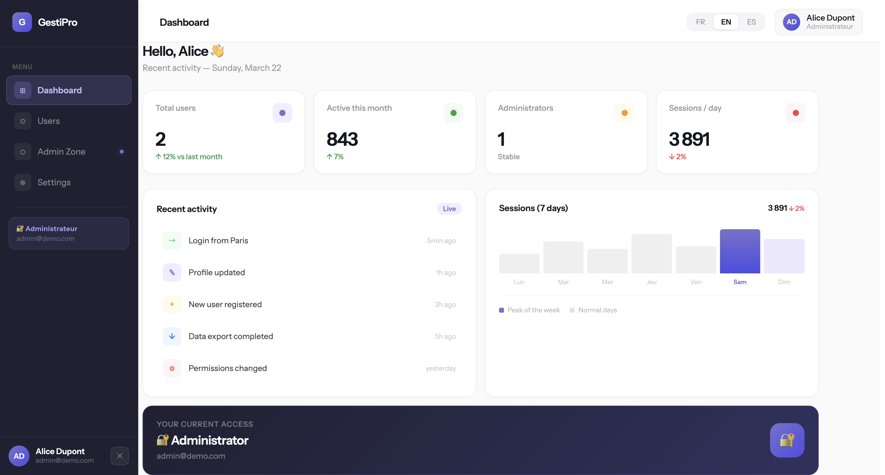
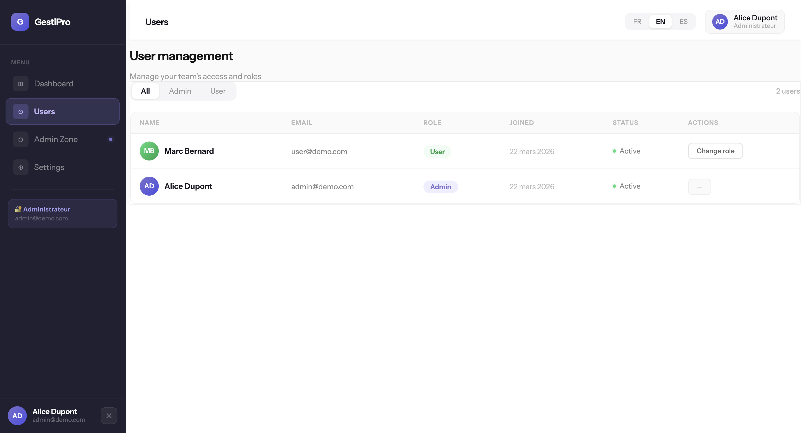
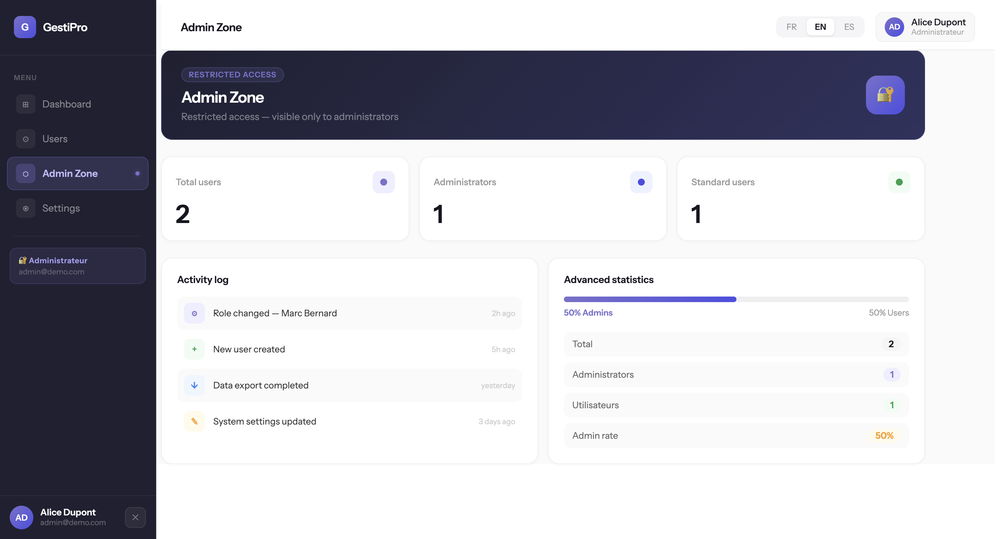
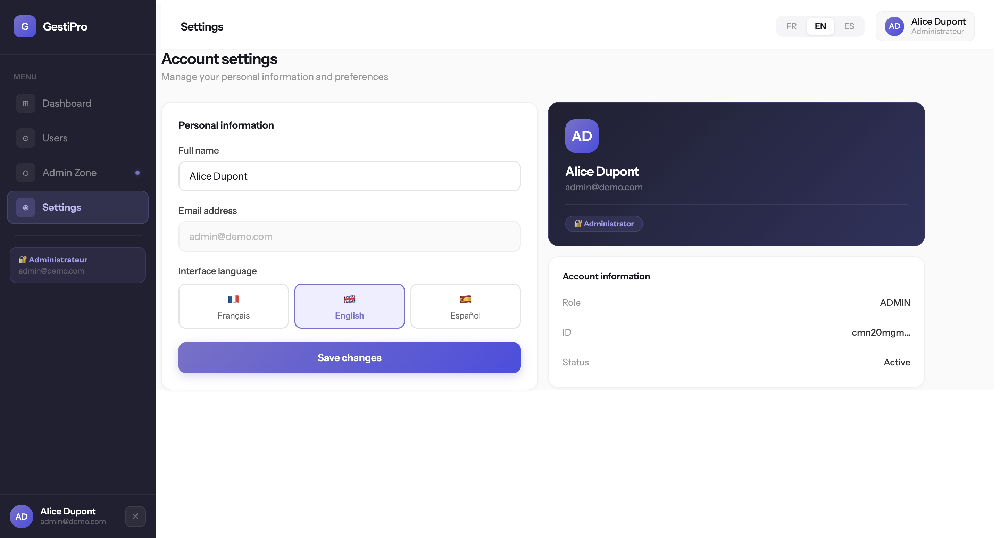

# GestiPro — Role-Based Dashboard with i18n (FR/EN/ES)


A production-ready web dashboard built with Next.js App Router, featuring JWT authentication, role-based access control (ADMIN/USER), and full internationalization across three languages: French, English, and Spanish.

---

## Live Demo

🔗 [gestipro-git-main-adrians-projects-9d5c028d.vercel.app](https://gestipro-git-main-adrians-projects-9d5c028d.vercel.app)

### Demo Credentials

| Role | Email | Password |
|------|-------|----------|
| Administrator | admin@demo.com | Admin123! |
| User | user@demo.com | User123! |

---

## Problem Statement

Small and medium-sized enterprises (PMEs) in France frequently need internal management tools to handle team members, assign permissions, and manage access levels — yet most off-the-shelf solutions are either too complex or not localized for multilingual teams.

GestiPro solves this by providing a clean, lightweight, self-hostable dashboard that:
- Enforces role-based access so admins control what users can see and do
- Supports three languages out of the box, making it suitable for international teams
- Demonstrates a complete authentication and authorization flow using modern web standards

---

## Screenshots

### Login
Split-screen login page with demo account shortcuts. Language can be switched before signing in.



### Dashboard
Real-time metrics pulled from the database, recent activity feed, sessions chart, and current user access card.



### Users
Full user table with role badges, avatar initials, and role filter. Admins can promote/demote any user except themselves.




### Admin Zone
Restricted to ADMIN role only. Shows advanced stats, role distribution bar, and activity log.



### Settings
Edit display name, switch interface language visually, and view account information.



---

## Features

### Authentication
- Secure sign-in and registration with email and password
- Passwords hashed with bcrypt (12 salt rounds)
- Sessions managed via JWT — no database sessions needed
- Protected routes via Next.js middleware — unauthenticated users are redirected to login

### Role-Based Access Control
- Two roles: **ADMIN** and **USER**
- Admin-only pages are protected at three independent levels: middleware, server component, and UI
- Admins can promote/demote users directly from the Users table
- Admins cannot change their own role
- Non-admin users cannot see the Admin Zone in the sidebar or navigate to it

### Internationalization (i18n)
- Three languages: French 🇫🇷, English 🇬🇧, Spanish 🇪🇸
- Language switcher in the top navigation bar, in Settings, and on the login/register pages
- Locale-prefixed URLs: `/fr/dashboard`, `/en/users`, `/es/settings`
- All UI text, labels, dates, and dynamic content are fully translated
- Built with `next-intl` v4 using the App Router pattern with `setRequestLocale`

### Pages
- **Dashboard** — real-time metrics from the database, activity feed, session chart, user access card
- **Users** — user table with role badges, filter by role, change role (admin only)
- **Admin Zone** — restricted panel with advanced stats, role distribution chart, and activity log
- **Settings** — personal info editor, language selector, account information card

---

## Tech Stack

| Layer | Technology | Reason |
|-------|-----------|--------|
| Framework | Next.js 16 (App Router) | Server Components, file-based routing, middleware |
| Language | TypeScript | Type safety across the full stack |
| Authentication | NextAuth.js v4 | Industry-standard auth with JWT strategy |
| Database ORM | Prisma v5 | Type-safe queries, migrations, seed scripts |
| Database | SQLite (dev) / PostgreSQL via Neon (prod) | Zero-config locally, scalable in production |
| i18n | next-intl v4 | First-class App Router support, locale routing |
| Styling | Tailwind CSS + inline styles | Utility classes + precise component control |
| Typography | Instrument Sans + Instrument Serif | Distinctive, professional aesthetic |
| Hosting | Vercel + Neon | Native Next.js deployment, serverless PostgreSQL |

---

## Project Structure

```
gestipro/
├── messages/                        # Translation files
│   ├── fr.json                      # French
│   ├── en.json                      # English
│   └── es.json                      # Spanish
├── prisma/
│   ├── schema.prisma                # Database schema
│   └── seed.ts                      # Demo users seed
├── src/
│   ├── app/
│   │   ├── [locale]/                # i18n route group
│   │   │   ├── layout.tsx           # Root locale layout (html, body, providers)
│   │   │   ├── (auth)/              # Public pages
│   │   │   │   ├── login/
│   │   │   │   └── register/
│   │   │   └── (dashboard)/         # Protected pages
│   │   │       ├── layout.tsx       # Dashboard shell (sidebar + topbar)
│   │   │       ├── dashboard/
│   │   │       ├── users/
│   │   │       ├── admin/           # ADMIN only
│   │   │       └── settings/
│   │   └── api/
│   │       ├── auth/[...nextauth]/  # NextAuth handler
│   │       ├── register/            # User registration
│   │       └── users/role/          # Role update (ADMIN only)
│   ├── components/
│   │   ├── layout/
│   │   │   ├── Sidebar.tsx          # Navigation + user info + logout
│   │   │   └── Topbar.tsx           # Page title + language switcher
│   │   └── ui/
│   │       ├── LoginForm.tsx        # Client-side login form
│   │       ├── UsersTable.tsx       # Interactive users table with filters
│   │       ├── ActivityList.tsx     # Activity feed (server component)
│   │       └── SettingsForm.tsx     # Settings form with lang switcher
│   ├── lib/
│   │   ├── auth.ts                  # NextAuth config + authorize logic
│   │   └── prisma.ts                # Prisma client singleton
│   ├── types/
│   │   └── next-auth.d.ts           # Session type extensions (role, id)
│   ├── i18n.ts                      # next-intl request config
│   ├── routing.ts                   # Locale routing definition
│   └── middleware.ts                # Auth + i18n middleware
├── .env.example                     # Environment variables template
└── next.config.ts                   # Next.js + next-intl config
```

---

## Running Locally

```bash
# Clone the repository
git clone https://github.com/AdrianMalmierca/gestipro.git
cd gestipro

# Install dependencies
npm install

# Set up environment variables
cp .env.example .env
# Fill in DATABASE_URL, NEXTAUTH_SECRET, and NEXTAUTH_URL

# Generate Prisma client and run migrations
npx prisma generate
npx prisma migrate dev --name init
npx prisma db seed

# Start the development server
npm run dev
```

Open [http://localhost:3000](http://localhost:3000) — it redirects to `/fr/login`.

### Environment Variables

```env
DATABASE_URL="file:./dev.db"                     # SQLite for local dev
NEXTAUTH_SECRET="your-secret-min-32-chars"       # Generate with: openssl rand -base64 32
NEXTAUTH_URL="http://localhost:3000"
```
---

## Architecture Decisions

### Server vs Client Components
Pages and layouts are Server Components by default — they fetch data and render HTML on the server. Only interactive parts (forms, tables with state, the language switcher) are Client Components. Translations are fetched server-side with `getTranslations()` and passed as props to client components, avoiding provider context issues.

### Middleware Strategy
A single `middleware.ts` handles both i18n routing (via `next-intl`) and authentication (via `next-auth/jwt`). Public pages (login, register) bypass auth and go straight to the intl middleware. Protected pages check for a valid JWT first, then fall through to locale detection.

### Role Protection at Multiple Levels
Roles are enforced at three independent layers:
1. **Middleware** — redirects unauthenticated users before the page renders
2. **Server Component** — `admin/page.tsx` redirects non-admins server-side
3. **UI** — the sidebar only renders the Admin Zone link for ADMIN users

### i18n with setRequestLocale
Each page receives `params.locale` from the dynamic route segment and calls `setRequestLocale(locale)` before any translations are loaded. This ensures `getTranslations()` always resolves to the correct locale, even when navigating between pages without a full reload.

---

## API Routes

| Method | Endpoint | Auth | Description |
|--------|----------|------|-------------|
| POST | `/api/auth/callback/credentials` | Public | NextAuth sign-in |
| GET | `/api/auth/session` | Public | Get current session |
| POST | `/api/register` | Public | Create new user account |
| PATCH | `/api/users/role` | ADMIN only | Update a user's role |

---

## Future Improvements

### Short Term
- **Password change** — allow users to update their password from Settings
- **User deactivation** — soft-delete users instead of permanent removal
- **Toast notifications** — visual feedback on role changes and settings saves
- **Form validation** — password strength indicator on register

### Medium Term
- **Audit log** — persist real admin actions to the database instead of static mock data
- **Email verification** — verify email address on registration with a confirmation link
- **OAuth providers** — add Google / GitHub sign-in via NextAuth
- **Dark mode** — system-preference-aware dark theme

### Long Term
- **Multi-tenancy** — support multiple organizations with isolated data
- **RBAC expansion** — granular permissions beyond ADMIN/USER (e.g., MANAGER, VIEWER)
- **Metrics persistence** — store daily session counts in the database for real chart data
- **Export functionality** — CSV/PDF export of user lists and activity logs

---

## What I Learned Building This

### Next.js App Router Patterns
Working with the App Router forced me to think clearly about the boundary between Server and Client Components. The key insight: fetch data server-side and pass it as props to client components that need interactivity — rather than fetching everything on the client and dealing with loading states and waterfalls.

### i18n Complexity in SSR
Internationalization in a full-stack SSR app is significantly more complex than in a SPA. The main challenge was ensuring `setRequestLocale` was called in every page component receiving `params`, not just in the root layout. Without this, `getTranslations()` silently falls back to the default locale regardless of the URL.

### Prisma Version Compatibility
During development I encountered significant breaking changes between Prisma v5 and v7 — particularly around enum support in SQLite and the new `prisma.config.ts` pattern introduced in v7. This reinforced the importance of pinning dependency versions and reading changelogs carefully before upgrading.

### Middleware Composition
Combining two middleware libraries (next-intl and next-auth) in a single `middleware.ts` requires careful ordering. The auth check must happen before i18n processing for protected routes, but i18n must run first on public routes to detect the locale for redirect URLs.

### JWT Session Extension
Extending NextAuth's session type with custom fields (role, id) requires both runtime callbacks in `auth.ts` and TypeScript declaration merging in `next-auth.d.ts`. Getting this right across `jwt()` and `session()` callbacks was a key learning about how NextAuth's dual runtime/type system works.

---

## License

MIT — free to use, modify, and deploy.

---

## Author

**Adrián Martín Malmierca**  
Computer Engineer & Mobile Applications Master's Student  
[GitHub](https://github.com/AdrianMalmierca) · [LinkedIn](https://www.linkedin.com/in/adri%C3%A1n-mart%C3%ADn-malmierca-4aa6b0293/)

*Built as a portfolio project targeting the French tech market — ESNs and PMEs in Burgundy/Dijon.*